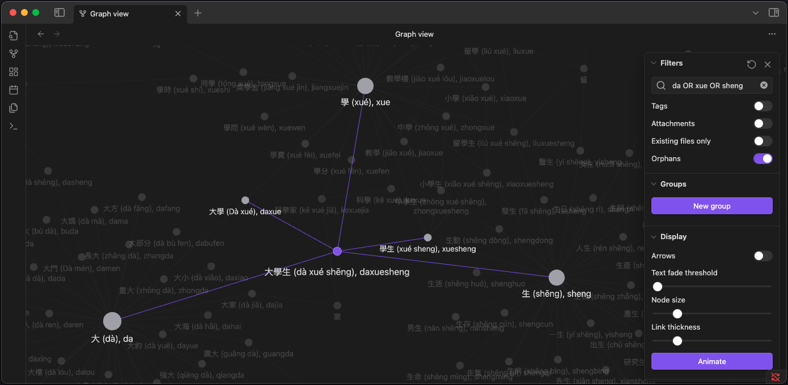

# HSK Character Map

When learning Chinese, it's often difficult to remember which words contain specific characters or how characters combine to form different meanings. Existing tools like [Pleco](https://www.pleco.com/) don't allow filtering by HSK levels or clearly show character relationships.

This tool creates an interactive graphical dictionary for [Obsidian](https://obsidian.md/) that visualizes how Chinese characters connect across HSK vocabulary. By understanding these relationships, you can learn vocabulary faster - when you know one character, you can easily understand more complex words that use the same character.

## How It Works

The tool analyzes HSK vocabulary to find character relationships and creates interconnected markdown files. For example:

**学习** (xué xí) - "to study" contains:
- **学** (xué) - "to study; school" 
- **习** (xí) - "to practice; habit"

Both individual characters also appear in other words:
- **学生** (xué shēng) - "student" 
- **练习** (liàn xí) - "to practice; exercise"

This creates a web of connections that helps you understand how characters combine and recombine to form different meanings.

## Visual Example
<div align="center">

</div>

## How to Use

### Option 1: Download Pre-built Obsidian Vaults (Recommended)

1. Go to the [Releases](../../releases) page
2. Download the vault for your desired HSK level(s):
   - `HSK-1-Traditional.zip` / `HSK-1-Simplified.zip`
   - `HSK-1-4-Traditional.zip` / `HSK-1-4-Simplified.zip`
   - etc.
3. Extract the zip file
4. Open Obsidian → "Open folder as vault"
5. Select the extracted directory
6. Switch to Graph View to visualize character relationships

### Option 2: Generate Custom Vault with Julia Script

For developers or those wanting specific HSK level combinations:

1. **Prerequisites**: Julia 1.11+ with JSON package
2. **Data**: Ensure HSK JSON files are in `data/hsk_raw/` directory
3. **Run**: Execute `julia main.jl` and follow the prompts to select:
   - HSK levels (e.g., `1-4`, `1,3,5`, or `6`)
   - Character type (traditional or simplified)
4. **Open**: Use the generated `ObsidianVault` directory in Obsidian

## Output Structure

Each word generates a markdown file with:
- HSK level tags (`#hsk1`, `#hsk2`, etc.)
- English meanings
- Character component links organized by:
  - Individual Characters
  - Two-Character Words  
  - Three-Character Words
  - Multi-Character Words

**Example**: `學習 (xué xí), xuexi.md`
```markdown
#hsk1
to study; to learn

## Character Components
### Individual Characters:
- [[學 (xué), xue]] (to study; school)
- [[習 (xí), xi]] (to practice; habit)

### Two-Character Words:
- [[練習 (liàn xí), lianxi]] (to practice; exercise)
```

## Acknowledgments

- Inspired by [Vietnamese Language Graph](https://github.com/DavidASix/vietnamese-language-graph) by DavidASix
- HSK vocabulary data from [Complete HSK Vocabulary](https://github.com/drkameleon/complete-hsk-vocabulary)

